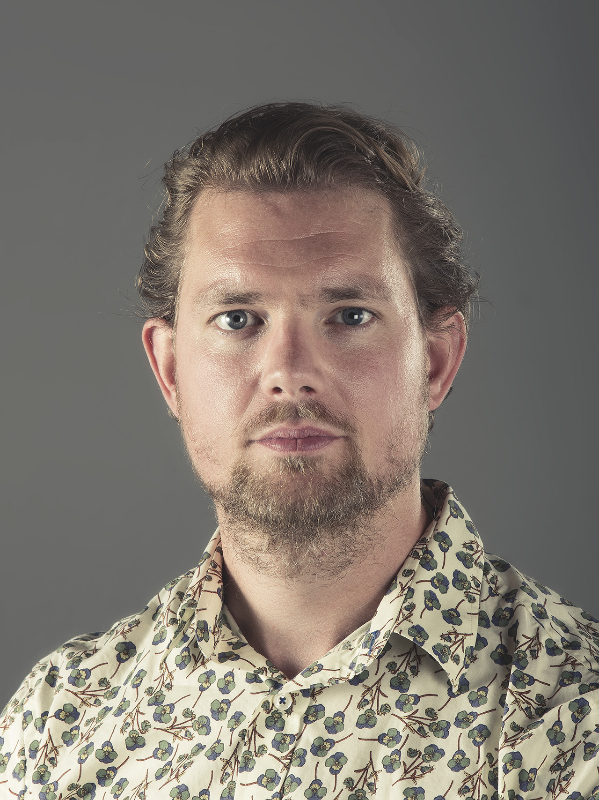

    

        

            <h1>
                Lebenslauf
            </h1>
        

         
        

            

                Fabian Meyer 
                Obergrundstrasse 117 
                6005 Luzern
            

        

         
        

            <a href="mailto:fabian@meyerfoto.ch">Mail: fabian@meyerfoto.ch</a> 
        

    

    

        
    

## Persönliche Daten

* Geboren am 20.06.1987
* Heimatort: Luzern
* Zivilstand: Ledig

## Schulischer Werdegang

* 2016 - 2020   &nbsp; Bachelor of Science Informatik, Hochschule Luzern. Major in Artificial Intelligence & Visual Computing, Thesis: «Object detection in fine art photography», Betreuer: Dr. Simone Lionetti 
* 2012 - 2015   &nbsp; Bachelor of Science Umweltnaturwissenschaften, ETH Zürich. Major in Human Environment Systems, Thesis: «Die Darstellung der Umweltproblematik im amerikanischen Spielfilm», Betreuer: Prof. Dr. Thomas N. Friemel 
* 2011 - 2012   &nbsp; Passerelle-Lehrgang MSE Luzern 
* 2010 - 2011   &nbsp; Gestalterische Berufsmaturität Luzern 
* Juli 2010     &nbsp; 4 Wochen Sprachschule in Montpellier, Frankreich 
* 2004 - 2008   &nbsp; SfGB+B Berufsschule Bern 
* 2003 - 2004   &nbsp; Musisches 10. Schuljahr Luzern 
* 2000 - 2003   &nbsp; Sekundarschule Rothenburg 
* 1994 - 2000   &nbsp; Primarschule Rothenburg 

## Beruflicher Werdegang

* 2020 - 2021   &nbsp; Internship als Programmierer (Analyse von Satellitendaten) beim Bundesamt für Meteorologie und Klimatologie in Locarno-Monti (Referenz: Herr Marco Sassi) 
* 2019 - 2021   &nbsp; Anstellung als Nachtwächter bei der Securitas AG, 6003 Luzern	 (Referenz: Herr Alfred Schnellmann) 
* 2018 - 2019	&nbsp; Praktikum als Frontend Developer bei WebKinder GmbH, 6005 Luzern (Referenz: Herr Enrik Berisha) 
* 2017 - 2019	&nbsp; Selbstständige Tätigkeit als Nachhilfelehrer im Fach Mathematik / Statistik 
* 2016 - 2019	&nbsp; Veranstaltungslogistik beim KKL Luzern Management AG, 6005 Luzern  
* 2015 - 2016	&nbsp; Diverse Jobs, sowie Reisen. Z.B Datenerfassung- und Bereinigung bei der	Ausgleichskasse Luzern, 6006 Luzern (Referenz: Herr Alain Rogger) 
* 2009 - 2010 	&nbsp; Anstellung als Allrounder, Schallplatten- und Comicshop Comix-Remix, 6003 Luzern (Referenz: Herr Benno Schärli) 
* 2008 - 2009 	&nbsp; Anstellung als Fotograf und Bildbearbeiter, Creative Foto AG, 6023 Rothenburg (Referenz: Frau Milena Polinelli) 
* 2004 - 2008 	&nbsp; Ausbildung zum Fotograf EFZ, Fotostudio Daniel Meyer, 6005 Luzern (Referenz: Herr Daniel Meyer) 

## Sprachliche Fertigkeiten

* Deutsch:      Muttersprache 
* Englisch:     Niveau Cambridge Advanced English 
* Französisch:  Niveau Berufsmaturität 

## Informatik Kenntnisse

* Datenverarbeitung mit R (tidyverse) und Python (pandas, numpy) 
* Arbeiten auf Linux server via SSH (Ubuntu, RedHat) 
* Schreiben von shell scripts mit BASH / SH 
* Produktion von Dashboards / Webapps mit R (Shiny) und Python (Plotly-Dash) 
* Webentwicklung mit WordPress als Frontend-Entwickler (HTML5, CSS3, JavaScript, PHP), Templating-Engines (Twig), CSS-Präprozessoren (Sass) 
* Umgang mit Git (sowie GitHub und GitLab) 
* Erfahrung mit Deeplearning-frameworks Keras und MMDetection 
* Bildverarbeitung mit Python (openCV, PIL) 
* JavaScript Technologien: React, Vue 
* Static Site Generators: Gatsby 
* Erfahrung mit REST API 
* Erfahrung mit CMS: WordPress & Netlify 
* Grundkentnisse in C++, Java und Matlab 
* Grundkentnisse in Rust (momentan am Lernen) 
* Erfahrung mit Blender, Three.js, WebGL  (3D-Modelling, Rendering) 

## Fotografische Kenntnisse

* Fotografische Aufnahmetechnik: Bedienung von Klein-, Mittel- und Grossformatkameras 
* Bedienung von fotografischen Lichtsystemen 
* Bildbearbeitung, Retusche und Bildkomposition 
* Helligkeits- und Farboptimierungen 
* Bedienung von Grossformatprinter: Kodak RP 30 & SRP 30, Durst Theta 50 & 51 

## Sonstige Fertigkeiten

* Analytisches Denken und Umgang mit Zahlen 
* Grundlagenwissen in Naturwissenschaften, Mathematik, Statistik und Umweltwissenschaften 
* Kreativität und Freude an der Gestaltung 
* Erfahrung in der Datenerhebung, -analyse und -auswertung 
* Sicher im Umgang mit den Betriebssystemen Windows und MacOS 
* Sicher im Umgang mit Microsoft Word, Excel und PowerPoint 
* Adobe Photoshop: Professionelle Kenntnisse 
* Adobe InDesign und Illustrator: Grundkenntnisse 

## Hobbies & Interessen

* Computer und Informatik 
* Kunst, Fotografie, Film, Design und Literatur 
* Musik und Synthesizer 
* Sport und Natur 
* Kochen und Reisen 
